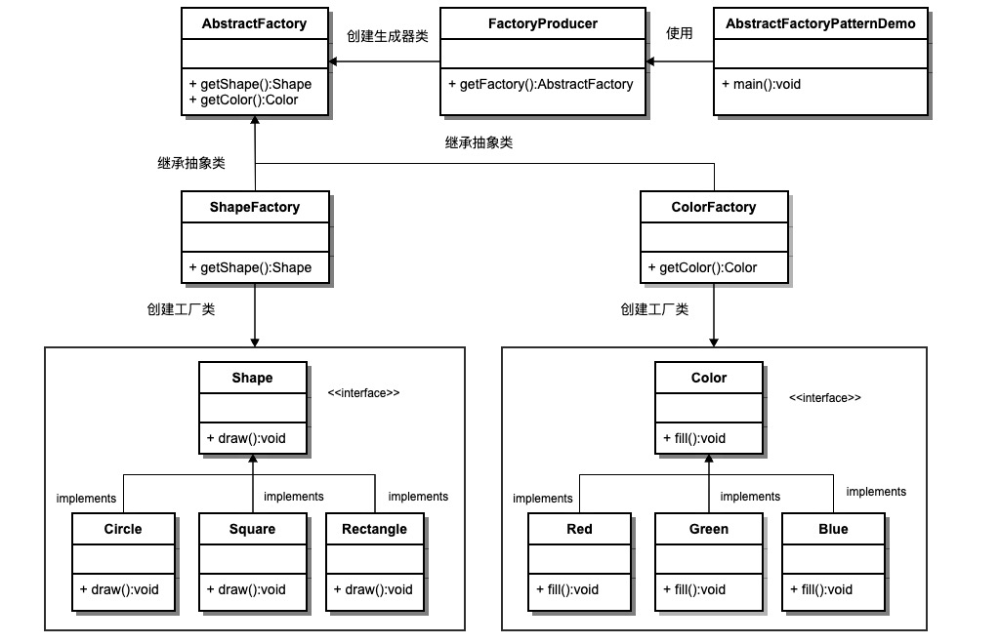

# 抽象工厂模式

## 简介

抽象工厂模式（Abstract Factory Pattern）是围绕一个超级工厂创建其他工厂。该超级工厂又称为其他工厂的工厂。这种类型的设计模式属于创建型模式，它提供了一种创建对象的最佳方式。
在抽象工厂模式中，接口是负责创建一个相关对象的工厂，不需要显式指定它们的类。每个生成的工厂都能按照工厂模式提供对象。
抽象工厂模式提供了一种创建一系列相关或相互依赖对象的接口，而无需指定具体实现类。通过使用抽象工厂模式，可以将客户端与具体产品的创建过程解耦，使得客户端可以通过工厂接口来创建一族产品。

## 意图
提供一个创建一系列相关或相互依赖对象的接口，而无需指定它们的具体类。

## 主要解决
接口选择的问题。

## 适用场景
当系统需要创建多个相关或依赖的对象，而不需要指定具体类时。

## 解决方案
在一个产品族中定义多个产品，由具体工厂实现创建这些产品的方法。

## 关键代码
在一个工厂中聚合多个同类产品的创建方法。

## 应用实例
假设有不同类型的衣柜，每个衣柜（具体工厂）只能存放一类衣服（成套的具体产品），如商务装、时尚装等。每套衣服包括具体的上衣和裤子（具体产品）。所有衣柜都是衣柜类（抽象工厂）的具体实现，所有上衣和裤子分别实现上衣接口和裤子接口（抽象产品）。

## 优点
1. 确保同一产品族的对象一起工作。
2. 客户端不需要知道每个对象的具体类，简化了代码。
缺点
3. 扩展产品族非常困难。增加一个新的产品族需要修改抽象工厂和所有具体工厂的代码。

## 使用场景
1. GUI工具包：不同的操作系统（如Windows、Linux）提供了不同的GUI工具包，抽象工厂模式可以用于创建具体的按钮、文本框等GUI组件。
2. 数据库访问：数据库访问框架可以根据配置文件或运行时参数选择不同的数据库访问驱动，抽象工厂模式可以用于创建不同类型的数据库连接和操作对象。
3. 游戏开发：在游戏开发中，可以使用抽象工厂模式来创建不同种类的角色、武器、装备等物品。

## 注意事项
扩展产品族困难，但扩展产品等级相对容易。

## 结构
抽象工厂模式包含以下几个主要角色：
1. 抽象工厂（Abstract Factory）：声明了一组用于创建产品对象的方法，每个方法对应一种产品类型。抽象工厂可以是接口或抽象类。描述具体工厂的公共接口，是具体工厂的父类。
2. 具体工厂（Concrete Factory）：实现了抽象工厂接口，负责创建具体产品对象的实例。
3. 抽象产品（Abstract Product）：定义了一组产品对象的共同接口或抽象类，描述了产品对象的公共方法。
4. 具体产品（Concrete Product）：实现了抽象产品接口，定义了具体产品的特定行为和属性。

抽象工厂模式通常涉及一族相关的产品，每个具体工厂类负责创建该族中的具体产品。客户端通过使用抽象工厂接口来创建产品对象，而不需要直接使用具体产品的实现类。

## 类图

## 实现
我们将创建 abstractFactory.factory.Shape 和 Color 接口和实现这些接口的实体类。下一步是创建抽象工厂类 AbstractFactory。接着定义工厂类 abstractFactory.factory.ShapeFactory 和 ColorFactory，这两个工厂类都是扩展了 AbstractFactory。然后创建一个工厂创造器/生成器类 abstractFactory.factory.FactoryProducer。

AbstractFactoryPatternDemo 类使用 abstractFactory.factory.FactoryProducer 来获取 AbstractFactory 对象。它将向 AbstractFactory 传递形状信息 abstractFactory.factory.Shape（CIRCLE / RECTANGLE / SQUARE），以便获取它所需对象的类型。同时它还向 AbstractFactory 传递颜色信息 Color（RED / GREEN / BLUE），以便获取它所需对象的类型。