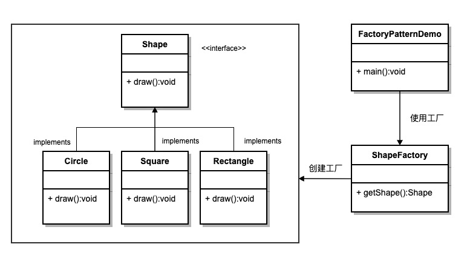

# 工厂模式

工厂模式（Factory Pattern）是 Java 中最常用的设计模式之一，它提供了一种创建对象的方式，使得创建对象的过程与使用对象的过程分离。

工厂模式提供了一种创建对象的方式，而无需指定要创建的具体类。

通过使用工厂模式，可以将对象的创建逻辑封装在一个工厂类中，而不是在客户端代码中直接实例化对象，这样可以提高代码的可维护性和可扩展性。

工厂模式的类型
1. 简单工厂模式（Simple Factory Pattern）：
简单工厂模式不是一个正式的设计模式，但它是工厂模式的基础。它使用一个单独的工厂类来创建不同的对象，根据传入的参数决定创建哪种类型的对象。
2. 工厂方法模式（Factory Method Pattern）： 工厂方法模式定义了一个创建对象的接口，但由子类决定实例化哪个类。工厂方法将对象的创建延迟到子类。
3. 抽象工厂模式（Abstract Factory Pattern）： 抽象工厂模式提供一个创建一系列相关或互相依赖对象的接口，而无需指定它们具体的类。

## 意图
定义一个创建对象的接口，让其子类决定实例化哪一个具体的类。工厂模式使对象的创建过程延迟到子类。

## 主要解决
接口选择的问题。

## 何时使用
当我们需要在不同条件下创建不同实例时。

## 如何解决
通过让子类实现工厂接口，返回一个抽象的产品。

## 关键代码
对象的创建过程在子类中实现。

## 应用实例
汽车制造：你需要一辆汽车，只需从工厂提货，而不需要关心汽车的制造过程及其内部实现。
Hibernate：更换数据库时，只需更改方言（Dialect）和数据库驱动（Driver），即可实现对不同数据库的切换。

## 优点
1. 调用者只需要知道对象的名称即可创建对象。
2. 扩展性高，如果需要增加新产品，只需扩展一个工厂类即可。
3. 屏蔽了产品的具体实现，调用者只关心产品的接口。
## 缺点
每次增加一个产品时，都需要增加一个具体类和对应的工厂，使系统中类的数量成倍增加，增加了系统的复杂度和具体类的依赖。

## 使用场景
1. 日志记录：日志可能记录到本地硬盘、系统事件、远程服务器等，用户可以选择记录日志的位置。
2. 数据库访问：当用户不知道最终系统使用哪种数据库，或者数据库可能变化时。
3. 连接服务器的框架设计：需要支持 "POP3"、"IMAP"、"HTTP" 三种协议，可以将这三种协议作为产品类，共同实现一个接口。

## 注意事项
工厂模式适用于生成复杂对象的场景。如果对象较为简单，通过 new 即可完成创建，则不必使用工厂模式。使用工厂模式会引入一个工厂类，增加系统复杂度。

## 结构
工厂模式包含以下几个主要角色：

1. 抽象产品（Abstract Product）：定义了产品的共同接口或抽象类。它可以是具体产品类的父类或接口，规定了产品对象的共同方法。
2. 具体产品（Concrete Product）：实现了抽象产品接口，定义了具体产品的特定行为和属性。
3. 抽象工厂（Abstract Factory）：声明了创建产品的抽象方法，可以是接口或抽象类。它可以有多个方法用于创建不同类型的产品。
4. 具体工厂（Concrete Factory）：实现了抽象工厂接口，负责实际创建具体产品的对象。

## 类图
