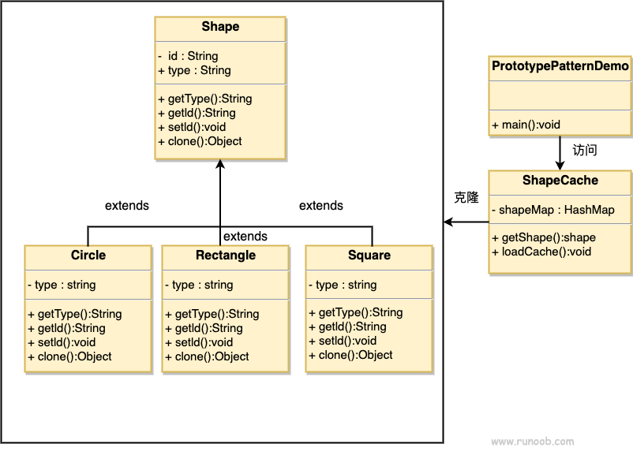

# 原型模式

## 简介
原型模式（Prototype Pattern）是用于创建重复的对象，同时又能保证性能。这种类型的设计模式属于创建型模式，它提供了一种创建对象的最佳方式之一。

这种模式是实现了一个原型接口，该接口用于创建当前对象的克隆。当直接创建对象的代价比较大时，则采用这种模式。例如，一个对象需要在一个高代价的数据库操作之后被创建。我们可以缓存该对象，在下一个请求时返回它的克隆，在需要的时候更新数据库，以此来减少数据库调用。

## 意图
使用原型实例指定要创建对象的种类，并通过拷贝这些原型创建新的对象。

## 主要解决
在运行时动态建立和删除原型。

## 何时使用
1. 系统应独立于产品的创建、构成和表示。
2. 需要在运行时指定实例化的类，例如通过动态加载。 
3. 避免创建与产品类层次平行的工厂类层次。 
4. 类的实例只能有几种不同状态组合，克隆原型比手工实例化更方便。

## 如何解决
通过已有的一个原型对象，快速生成与原型对象相同的实例。

## 关键代码
1. 实现克隆操作：
    - 在 Java 中，实现 Cloneable 接口，重写 clone() 方法。
    - 在 .NET 中，使用 Object 类的 MemberwiseClone() 方法实现浅拷贝，或通过序列化实现深拷贝。
2. 隔离类对象的使用者和具体类型之间的耦合关系，要求"易变类"拥有稳定的接口。

## 应用实例
1. 细胞分裂
2. Java 中的 Object.clone() 方法

## 优点
1. 性能提高
2. 避免构造函数的约束

## 缺点
1. 配备克隆方法需要全面考虑类的功能，对已有类可能较难实现，特别是处理不支持串行化的间接对象或含有循环结构的引用时。
2. 必须实现 Cloneable 接口。

## 使用场景
1. 资源优化
2. 类初始化需要消耗大量资源（如数据、硬件资源）
3. 性能和安全要求高的场景
4. 通过 new 创建对象需要复杂的数据准备或访问权限时
5. 一个对象需要多个修改者
6. 对象需提供给其他对象访问并可能被各个调用者修改时
7. 通常与工厂方法模式一起使用，通过 clone 创建对象，然后由工厂方法提供给调用者

## 注意事项
与直接实例化类创建新对象不同，原型模式通过拷贝现有对象生成新对象。浅拷贝通过实现 Cloneable 实现，深拷贝通过实现 Serializable 读取二进制流实现。

## 结构
原型模式包含以下几个主要角色：

1. **原型接口（Prototype Interface）**：定义一个用于克隆自身的接口，通常包括一个 clone() 方法。
2. **具体原型类（Concrete Prototype）**：实现原型接口的具体类，负责实际的克隆操作。这个类需要实现 clone() 方法，通常使用浅拷贝或深拷贝来复制自身。

## 类图

