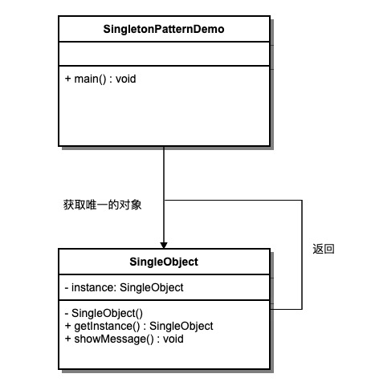

# 单例模式

## 简介
单例模式（Singleton Pattern）是 Java 中最简单的设计模式之一。这种类型的设计模式属于创建型模式，它提供了一种创建对象的最佳方式。

这种模式涉及到一个单一的类，该类负责创建自己的对象，同时确保只有单个对象被创建。这个类提供了一种访问其唯一的对象的方式，可以直接访问，不需要实例化该类的对象。

单例模式是一种创建型设计模式，它确保一个类只有一个实例，并提供了一个全局访问点来访问该实例。

注意：

1. 单例类只能有一个实例。
2. 单例类必须自己创建自己的唯一实例。
3. 单例类必须给所有其他对象提供这一实例。

## 意图
确保一个类只有一个实例，并提供一个全局访问点来访问该实例。

## 主要解决
频繁创建和销毁全局使用的类实例的问题。

## 何时使用
当需要控制实例数目，节省系统资源时。

## 如何解决
检查系统是否已经存在该单例，如果存在则返回该实例；如果不存在则创建一个新实例。

## 关键代码
构造函数是私有的。

## 应用实例
1. Windows 在多进程多线程环境下操作文件时，避免多个进程或线程同时操作一个文件，需要通过唯一实例进行处理。
2. 设备管理器设计为单例模式，例如电脑有两台打印机，避免同时打印同一个文件。

## 优点
1. 内存中只有一个实例，减少内存开销，尤其是频繁创建和销毁实例时（如管理学院首页页面缓存）。
2. 避免资源的多重占用（如写文件操作）。

## 缺点
1. 没有接口，不能继承。
2. 与单一职责原则冲突，一个类应该只关心内部逻辑，而不关心实例化方式。

## 使用场景
1. 生成唯一序列号。
2. WEB 中的计数器，避免每次刷新都在数据库中增加计数，先缓存起来。
3. 创建消耗资源过多的对象，如 I/O 与数据库连接等。

## 注意事项
1. **线程安全**：getInstance() 方法中需要使用同步锁 synchronized (Singleton.class) 防止多线程同时进入造成实例被多次创建。
2. **延迟初始化**：实例在第一次调用 getInstance() 方法时创建。
3. **序列化和反序列化**：重写 readResolve 方法以确保反序列化时不会创建新的实例。
4. **反射攻击**：在构造函数中添加防护代码，防止通过反射创建新实例。
5. **类加载器问题**：注意复杂类加载环境可能导致的多个实例问题。

## 结构
**单例模式包含以下几个主要角色**：

1. **单例类**：包含单例实例的类，通常将构造函数声明为私有。
2. **静态成员变量**：用于存储单例实例的静态成员变量。
3. **获取实例方法**：静态方法，用于获取单例实例。
4. **私有构造函数**：防止外部直接实例化单例类。
5. **线程安全处理**：确保在多线程环境下单例实例的创建是安全的。

## 类图

## 单例模式的几种实现方式

### 懒汉式，线程不安全
**是否 Lazy 初始化**：是

**是否多线程安全**：否

**实现难度**：易

**描述**：这种方式是最基本的实现方式，这种实现最大的问题就是不支持多线程。因为没有加锁 synchronized，所以严格意义上它并不算单例模式。

### 懒汉式，线程安全
**是否 Lazy 初始化**：是

**是否多线程安全**：是

**实现难度**：易

**描述**：这种方式具备很好的 lazy loading，能够在多线程中很好的工作，但是，效率很低，99% 情况下不需要同步。

**优点**：第一次调用才初始化，避免内存浪费。

**缺点**：必须加锁 synchronized 才能保证单例，但加锁会影响效率。
getInstance() 的性能对应用程序不是很关键（该方法使用不太频繁）。

### 饥饿式
**是否 Lazy 初始化**：否

**是否多线程安全**：是

**实现难度**：易

**描述**：这种方式比较常用，但容易产生垃圾对象。

**优点**：没有加锁，执行效率会提高。

**缺点**：类加载时就初始化，浪费内存。

它基于 classloader 机制避免了多线程的同步问题，不过，instance 在类装载时就实例化，虽然导致类装载的原因有很多种，在单例模式中大多数都是调用 getInstance 方法， 但是也不能确定有其他的方式（或者其他的静态方法）导致类装载，这时候初始化 instance 显然没有达到 lazy loading 的效果。

### 双重校验锁（DCL，即 double-checked locking）

**是否 Lazy 初始化**：是

**是否多线程安全**：是

**实现难度**：较复杂

**描述**：这种方式采用双锁机制，安全且在多线程情况下能保持高性能。

getInstance() 的性能对应用程序很关键。