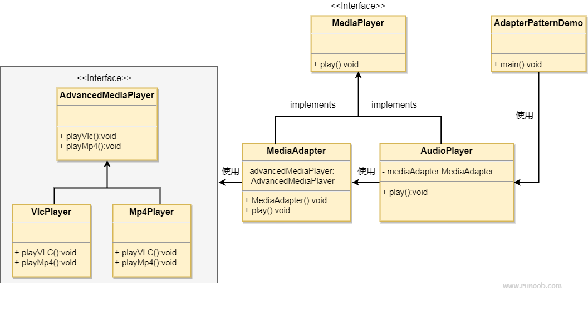

# 适配器模式

## 简介
适配器模式（Adapter Pattern）充当两个不兼容接口之间的桥梁，属于结构型设计模式。它通过一个中间件（适配器）将一个类的接口转换成客户期望的另一个接口，使原本不能一起工作的类能够协同工作。

这种模式涉及到一个单一的类，该类负责加入独立的或不兼容的接口功能。举个真实的例子，读卡器是作为内存卡和笔记本之间的适配器。您将内存卡插入读卡器，再将读卡器插入笔记本，这样就可以通过笔记本来读取内存卡。

假设有一个音频播放器，它只能播放 MP3 文件。现在，我们需要播放 VLC 和 MP4 文件，可以通过创建一个适配器来实现：

- **目标接口**：定义一个可以播放多种格式文件的音频播放器接口。
- **适配者类**：现有的音频播放器，只能播放 MP3 文件。
- **适配器类**：创建一个新的类，实现目标接口，并在内部使用适配者类来播放 MP3 文件，同时添加对 VLC 和 MP4 文件的支持。

## 目的
将一个类的接口转换为另一个接口，使得原本不兼容的类可以协同工作。

## 主要解决的问题
在软件系统中，需要将现有的对象放入新环境，而新环境要求的接口与现有对象不匹配。

## 使用场景
1. 需要使用现有类，但其接口不符合系统需求。 
2. 希望创建一个可复用的类，与多个不相关的类（包括未来可能引入的类）一起工作，这些类可能没有统一的接口。 
3. 通过接口转换，将一个类集成到另一个类系中。

## 实现方式
**继承或依赖**：推荐使用依赖关系，而不是继承，以保持灵活性。

## 关键代码

适配器通过继承或依赖现有对象，并实现所需的目标接口。

## 应用实例
1. 接口转换：例如，将 Java JDK 1.1 的 Enumeration 接口转换为 1.2 的 Iterator 接口。
2. 跨平台运行：在Linux上运行Windows程序。
3. 数据库连接：Java 中的 JDBC 通过适配器模式与不同类型的数据库进行交互。

## 优点
1. 促进了类之间的协同工作，即使它们没有直接的关联。
2. 提高了类的复用性。
3. 增加了类的透明度。
4. 提供了良好的灵活性。

## 缺点
1. 过度使用适配器可能导致系统结构混乱，难以理解和维护。
2. 在Java中，由于只能继承一个类，因此只能适配一个类，且目标类必须是抽象的。

## 使用建议
1. 适配器模式应谨慎使用，特别是在详细设计阶段，它更多地用于解决现有系统的问题。
2. 在考虑修改一个正常运行的系统接口时，适配器模式是一个合适的选择。
3. 通过这种方式，适配器模式可以清晰地表达其核心概念和应用，同时避免了不必要的复杂性。

## 结构
适配器模式包含以下几个主要角色：

1. **目标接口（Target）**：定义客户需要的接口。
2. **适配者类（Adaptee）**：定义一个已经存在的接口，这个接口需要适配。
3. **适配器类（Adapter）**：实现目标接口，并通过组合或继承的方式调用适配者类中的方法，从而实现目标接口。

## 类图
