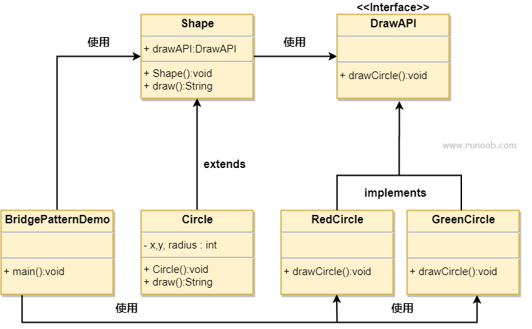

# 桥接模式

## 简介
桥接（Bridge）是用于把抽象化与实现化解耦，使得二者可以独立变化。这种类型的设计模式属于结构型模式，它通过提供抽象化和实现化之间的桥接结构，来实现二者的解耦。

这种模式涉及到一个作为桥接的接口，使得实体类的功能独立于接口实现类，这两种类型的类可被结构化改变而互不影响。

桥接模式的目的是将抽象与实现分离，使它们可以独立地变化，该模式通过将一个对象的抽象部分与它的实现部分分离，使它们可以独立地改变。它通过组合的方式，而不是继承的方式，将抽象和实现的部分连接起来。

## 意图
用于将抽象部分与实现部分分离，使得它们可以独立地变化。。

## 主要解决的问题
避免使用继承导致的类爆炸问题，提供更灵活的扩展方式。

## 使用场景
当系统可能从多个角度进行分类，且每个角度都可能独立变化时，桥接模式是合适的。

## 实现方式
**分离多角度分类**：将不同角度的分类逻辑分离，允许它们独立变化。
**减少耦合**：降低抽象与实现之间的耦合度。

## 关键代码
**抽象类**：定义一个抽象类，作为系统的一部分。
**实现类**：定义一个或多个实现类，与抽象类通过聚合（而非继承）关联。

## 应用实例
**转世投胎**：灵魂（抽象）与肉体（实现）的分离，允许灵魂选择不同的肉体。
**墙上的开关**：开关（抽象）与内部实现（实现）的分离，用户无需关心开关的内部工作机制。

## 优点
**抽象与实现分离**：提高了系统的灵活性和可维护性。
**扩展能力强**：可以独立地扩展抽象和实现。
**实现细节透明**：用户不需要了解实现细节。

## 缺点
**理解与设计难度**：桥接模式增加了系统的理解与设计难度。
**聚合关联**：要求开发者在抽象层进行设计与编程。

## 使用建议
1. 当系统需要在抽象化角色和具体化角色之间增加灵活性时，考虑使用桥接模式。
2. 对于不希望使用继承或因多层次继承导致类数量急剧增加的系统，桥接模式特别适用。
3. 当一个类存在两个独立变化的维度，且这两个维度都需要扩展时，使用桥接模式。

## 注意事项
桥接模式适用于两个独立变化的维度，确保它们可以独立地扩展和变化。

## 结构
以下是桥接模式的几个关键角色：

- **抽象（Abstraction）**：定义抽象接口，通常包含对实现接口的引用。
- **扩展抽象（Refined Abstraction）**：对抽象的扩展，可以是抽象类的子类或具体实现类。
- **实现（Implementor）**：定义实现接口，提供基本操作的接口。
- **具体实现（Concrete Implementor）**：实现实现接口的具体类。

## 类图
