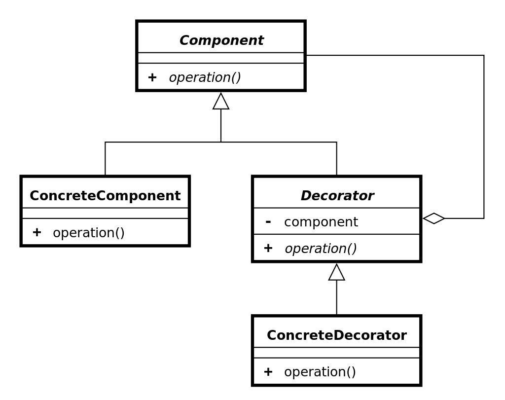

# 装饰器模式

## 简介
装饰器模式（Decorator Pattern）允许向一个现有的对象添加新的功能，同时又不改变其结构。这种类型的设计模式属于结构型模式，它是作为现有的类的一个包装。

装饰器模式通过将对象包装在装饰器类中，以便动态地修改其行为。

这种模式创建了一个装饰类，用来包装原有的类，并在保持类方法签名完整性的前提下，提供了额外的功能。

## 意图
动态地给一个对象添加额外的职责，同时不改变其结构。装饰器模式提供了一种灵活的替代继承方式来扩展功能。

## 主要解决的问题
1. 避免通过继承引入静态特征，特别是在子类数量急剧膨胀的情况下。 
2. 允许在运行时动态地添加或修改对象的功能。

## 使用场景
1. 当需要在不增加大量子类的情况下扩展类的功能。
2. 当需要动态地添加或撤销对象的功能。

## 实现方式
- 定义组件接口：创建一个接口，规定可以动态添加职责的对象的标准。
- 创建具体组件：实现该接口的具体类，提供基本功能。
- 创建抽象装饰者：实现同样的接口，持有一个组件接口的引用，可以在任何时候动态地添加功能。
- 创建具体装饰者：扩展抽象装饰者，添加额外的职责。

## 关键代码
- Component接口：定义了可以被装饰的对象的标准。
- ConcreteComponent类：实现Component接口的具体类。
- Decorator抽象类：实现Component接口，并包含一个Component接口的引用。
- oncreteDecorator类：扩展Decorator类，添加额外的功能。

## 应用实例
孙悟空的72变：孙悟空（ConcreteComponent）通过变化（Decorator）获得新的能力。
画框装饰画：一幅画（ConcreteComponent）可以通过添加玻璃（ConcreteDecorator）和画框（ConcreteDecorator）来增强其展示效果。

## 优点
低耦合：装饰类和被装饰类可以独立变化，互不影响。
灵活性：可以动态地添加或撤销功能。
替代继承：提供了一种继承之外的扩展对象功能的方式。

## 缺点
复杂性：多层装饰可能导致系统复杂性增加。

## 使用建议
在需要动态扩展功能时，考虑使用装饰器模式。
保持装饰者和具体组件的接口一致，以确保灵活性。

## 注意事项
装饰器模式可以替代继承，但应谨慎使用，避免过度装饰导致系统复杂。

## 结构
装饰器模式包含以下几个核心角色：

- **抽象组件（Component）**：定义了原始对象和装饰器对象的公共接口或抽象类，可以是具体组件类的父类或接口。
- **具体组件（Concrete Component）**：是被装饰的原始对象，它定义了需要添加新功能的对象。
- **抽象装饰器（Decorator）**：继承自抽象组件，它包含了一个抽象组件对象，并定义了与抽象组件相同的接口，同时可以通过组合方式持有其他装饰器对象。
- **具体装饰器（Concrete Decorator）**：实现了抽象装饰器的接口，负责向抽象组件添加新的功能。具体装饰器通常会在调用原始对象的方法之前或之后执行自己的操作。

装饰器模式通过嵌套包装多个装饰器对象，可以实现多层次的功能增强。每个具体装饰器类都可以选择性地增加新的功能，同时保持对象接口的一致性。

## 类图

