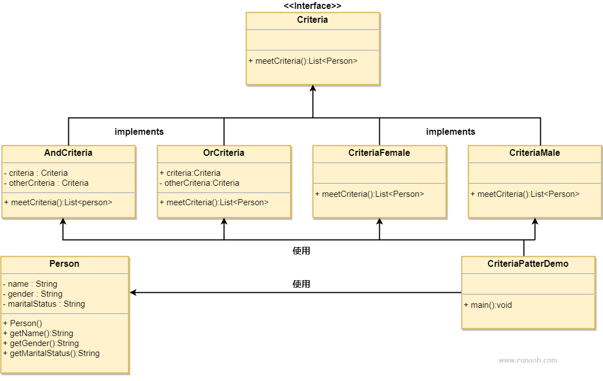

# 过滤器模式

## 简介
过滤器模式（Filter Pattern）或标准模式（Criteria Pattern）是一种设计模式，这种模式允许开发人员使用不同的标准来过滤一组对象，通过逻辑运算以解耦的方式把它们连接起来。这种类型的设计模式属于结构型模式，它结合多个标准来获得单一标准。

## 意图
用于将对象的筛选过程封装起来，允许使用不同的筛选标准动态地筛选对象。

## 主要解决的问题
当需要根据多个不同的条件或标准来筛选一组对象时，过滤器模式提供了一种灵活的方式来定义这些条件，避免在客户端代码中硬编码筛选逻辑。

## 使用场景
当对象集合需要根据不同的标准进行筛选时。
当筛选逻辑可能变化，或者需要动态地组合多个筛选条件时。

## 实现方式
1. 定义筛选接口：创建一个筛选接口，定义一个筛选方法。 
2. 实现具体筛选器：为每个筛选标准实现筛选接口，封装具体的筛选逻辑。 
3. 组合筛选器：允许筛选器之间进行组合，形成复杂的筛选逻辑。

## 关键代码
1. 筛选接口：定义筛选方法，如 matches()。
2. 具体筛选器类：实现筛选接口，封装具体的筛选逻辑。
3. 组合筛选器：实现筛选器的组合逻辑，如逻辑与（AND）、逻辑或（OR）等。

## 应用实例
1. 图书管理系统：根据作者、出版年份、类别等不同标准筛选图书。
2. 在线购物平台：根据价格、品牌、用户评分等条件筛选商品。

## 优点
1. 封装性：筛选逻辑被封装在独立的筛选器对象中。
2. 灵活性：可以动态地添加、修改或组合筛选条件。
3. 可扩展性：容易添加新的筛选标准，无需修改现有代码。

## 缺点
1. 复杂性：随着筛选条件的增加，系统可能变得复杂。
2. 性能问题：如果筛选器组合过于复杂，可能会影响性能。

## 使用建议
1. 当筛选逻辑可能变化或需要根据不同标准动态筛选对象时，考虑使用过滤器模式。
2. 在设计时，确保筛选器的接口和实现保持一致，以便于组合和扩展。

## 注意事项
1. 确保筛选器的组合逻辑正确无误，避免引入逻辑错误。
2. 在实现时，考虑性能影响，特别是在处理大量数据时。

## 概要
过滤器模式包含以下几个主要角色：

- 过滤器接口（Filter/Criteria）：定义一个接口，用于筛选对象。该接口通常包含一个方法，用于根据特定条件过滤对象。

- 具体过滤器类（Concrete Filter/Concrete Criteria）：实现过滤器接口，具体定义筛选对象的条件和逻辑。

- 对象集合（Items/Objects to be filtered）：要被过滤的对象集合。这些对象通常是具有共同属性的实例，例如一组人、一组产品等。

- 客户端（es.Client）：使用具体过滤器类来筛选对象集合。客户端将对象集合和过滤器结合起来，以获得符合条件的对象。

## 类图

